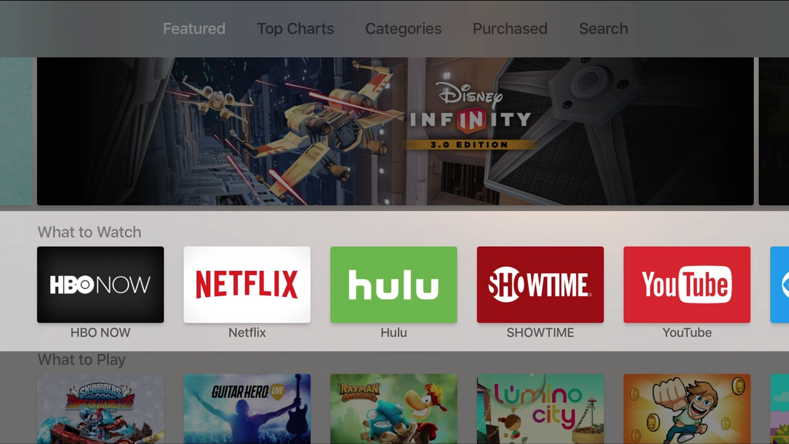
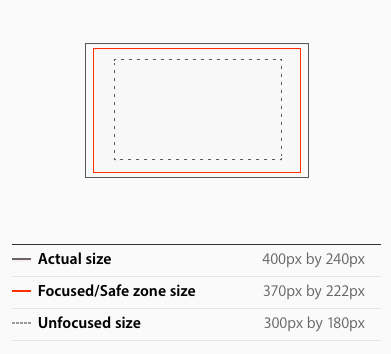
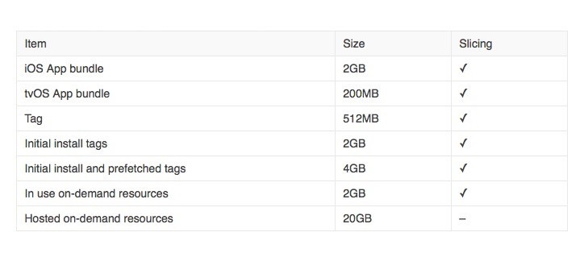
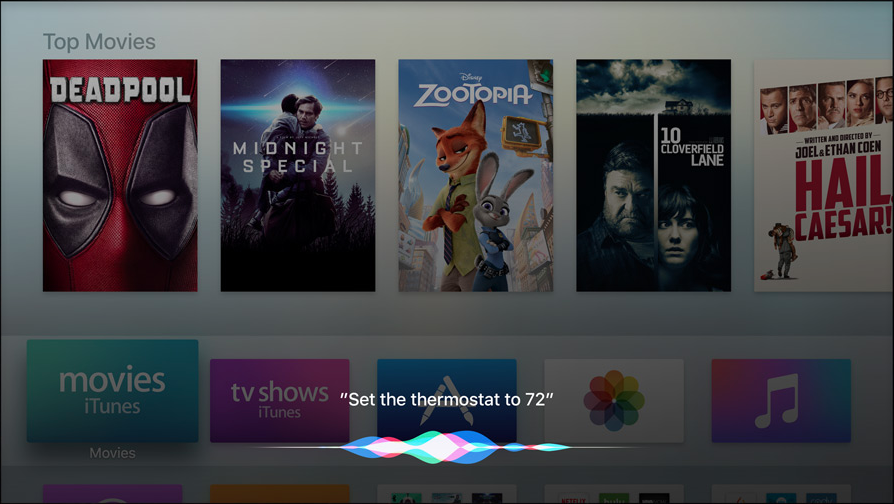
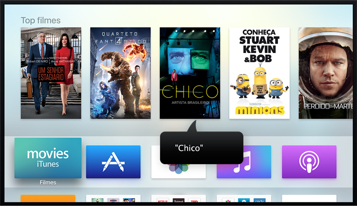

<!-- build-lists: true -->

# Criando aplicativos para a nova Apple TV

---

## Salmo Junior

Mineiro, Chapter Leader do CocoaHeads BH, dev iOS desde 2011, corinthiano, viajante e viciado em queijo.


<br><br><br><br><br><br><br><br><br><br><br><br><br>

salmo@ciandt.com
@salmojr

---

## Agenda

- Overview
- Interação com Usuário
- Design Guidelines
- Focus API
- On-Demand Resources
- TVMLKit
- Dicas

---

# Overview

---



---


---


---


---


---


---


---

## Apple TV

- Lançamento Set/2015
- Novo S.O. (tvOS)
- Experiencia personalizada
- Acessibilidade
- Developer Tools
- App Store


---

## Hardware

- 64-bit processador A8
- 32 GB ou 64 GB
- 2 GB de RAM
- 1080p
- HDMI


---

## tvOS 

Desenvolvimento

- SDK separado
- 64-bit com bitcode
- Universal Purchase
- Não necessita suporte à versões anteriores

---

## tvOS 

Desenvolvimento

- UIKit
- TVMLKit
- Swift / Objective-C / TVML / TVJS

---

## tvOS

Experiencia de uso

- Interação baseada em foco
- Utilizacão em família
- Device compartilhado

---

## tvOS

Sempre conectado

- Live Streaming
- On-Demand Resources
- Cloud Storage

---

## tvOS

Armazenamento de dados

- Armazenamento local limitado
- Não há garantia que as informações vão continuar no device na próxima vez que foi utilizado
- A pasta Documents existe, mas não tem permissão de escrita


---

## tvOS

Armazenamento de dados

- iCloud Key-Value Storage
- CloudKit
- Cloud Storage desejado


---

# Interação com Usuário

---

## Navegação

- Use gestos para dar fluidez
- Implemente o Voltar através do botão Menu
- Não exiba opção de Voltar
- Dar preferencia para navegação horizontal
- Use a navegação padrão dos compoentes


---

## Foco e Seleção

- Deixe nítido qual item está selecionado
- Implemente comportamento para diferentes status
- Nunca mostre um cursos


---

## Carregando conteúdo

- Deixe claro quando estiver carregando novos conteúdos
- Aproveite esse tempo para ensinar o usuário


---

## Carregando conteúdo

Customize suas telas de loading


---

## Carregando conteúdo

Exiba sua tela o mais rápido possível, não faça o usuário esperar até que todo o conteúdo seja baixado.


---

## Autenticação

- Retarde ao máximo possível o sign-in
- Evite o input de texto
- Mantenha suporte a multiplos perfis


---

## Top Shelf


---

## Top Shelf

Faça uso dos conteúdos dinâmicos

- Atalhos 
- Exibir favoritos
- Mostre conteúdo atrativo
- Não usar para propagandas e ofertas com preços

---

## Top Shelf

Sectioned Content Row

- Necessário conteúdo suficiente para completar uma linha


---

## Top Shelf

Scrolling Inset Banner 

- Necessário entre 3 e 8 imagens
- Textos somente dentro da imagem
- Scroll automatico entre os banners


---

## New Siri Remote /<br>Apple TV Remote


---

## Botões

- Implemente o comportamento esperado para cada botão
- Volume, Siri e Home são botões restritos


---

## Gestos

``` ``` ``` ``` ``` ``` ``` ``` ``` ``` ``` ``` ``` ``` ``` ``` ``` ``` ``` ``` ``` ``` ``` ``` ``` ``` ``` ``` Swipe ``` ``` ``` ``` ``` ``` ``` ``` ``` ``` ``` ``` ``` ``` ``` ``` ``` ``` ``` ``` ``` ``` ``` ``` ``` ``` ``` ``` ``` ``` ``` ``` ``` ``` ``` ``` ``` ``` ``` ``` ``` ``` ``` ``` ``` ``` ``` ``` ``` ``` ``` ``` ``` ``` ``` ``` Click ``` ``` ``` ``` ``` ``` ``` ``` ``` ``` ``` ``` ``` ``` ``` ``` ``` ``` ``` ``` ``` ``` ``` ``` ``` ``` ``` ``` ``` ``` ``` ``` ``` ``` ``` ``` ``` ``` ``` ``` ``` ``` ``` ``` ``` ``` ``` ``` ``` ``` ``` ``` ``` ``` ``` ``` ``` ``` ``` ``` ``` ``` Tap 


  

---

## Acelerômetro e Giroscópio


---

# Design Guidelines

---

## Otimize seus assets para tela grande

- Desenvolva para resolução de 1920x1080
- Assets somente @1x
- Teste suas imagens na TV


---

## Mantenha seu conteúdo principal distante das bordas

- 60 píxeis para Top e Bottom
- 90 píxeis para os lados


---

## Mantenha distância entre elementos

Com UIKit e Focus API, elementos de UI ficam maiores ao receber o foco.


---

## Mostre partes de elementos escondidos

Indique sempre que existe mais conteúdo fora area da tela, facilitando assim o acesso pelo usuário.


---

## Faça uso de Grids

- Fácil de encontrar conteúdo a distância
- Rápido de navegar com o controle


---

## Parallax

Use parallax para tornar itens com foco ainda mais responsiveis a interação do usuário.

Extensões:

- .lsr
- .lcr


---

## Parallax Tools

- Parallax Previewer para macOS
- Parallax Exporter Plug-In para Adobe Photoshop
- Xcode


---

## Criando imagens LSR pelo Xcode

- Basta adicionar seus PNGs no Assets Catalog e organizá-las usando o menu esquerdo.
- É possível exportar a imagem em formato LSR
- E também adicionar um arquivo LSR direto ao projeto


---

## Criando imagens LCR pelo Xcode

Para usar parallax em imagens fora do Bundle da app, é preciso converte-las para o formato .lcr

Basta usar a `layerutil` command-line tool que vem instalada junto com o Xcode.

```
xcrun —-sdk appletvos layerutil —-c <filename.lsr>
```

---

## Ícone

- Crie ícones com apenas um foco de atenção
- Mantenha o background simples
- Use texto somente quando for essencial ou parte do logo
- Mantenha as bordas do ícone quadradas


---

## Ícone

É preciso prover dois tamanhos de ícones

- Apple TV Home Screen

	- 400 X 240 px

- App Store
	
	- 1280 X 768 px



---

## Ícone

Seu ícone deve ter entre 2 e 5 camadas para dar a sensação de profundidade e vitalidae quando estiver em foco.


---

# Focus API

---

## Focus API

Introdução....
 


---

## Focus API

### 

- 
 


---

## Focus API

Preferred Focus

- 
 


---

## Focus API

### 

- 
 


---

## Focus API

Restoring Focus

- 
 


---

# On-Demand Resources

---

## On-Demand Resources

Recurso lançado no iOS 9 que permite armazenar conteúdo na App Store, separado do bundle da aplicação.

Conteúdo baixado somente quando necessário.


---

## On-Demand Resources

Por que usar?

- Aplicativo disponível para uso em poucos segundos
- Armazenamento remoto de arquivos raramente usados
- Armazenamento remote de arquivo in-app purchase


---

## On-Demand Resources

Por que usar para tvOS?

- App de no máximo 200mb para a App Store
- Apple TV não permite armazenamento local de dados
- Device conectado 100% do tempo

---

## On-Demand Resources

Os arquivos podem ser divididos em 3 tipos de tags

- Initial install
- Prefetch
- On demand

---

## On-Demand Resources

Limites



---

## On-Demand Resources

Boas práticas

- Tente criar tags de no máximo 64mb
- Baixe sempre com antecedência
- Descarte os arquivos quando não forem mais necessários

---

## On-Demand Resources

Habilitando ODR no Xcode


---

## On-Demand Resources

Criando tags


---

## On-Demand Resources

Use a classe **NSBundleResourceRequest** para

- Requisitar/Descartar on-demand resources
- Atualizar a prioridade dos downloads
- Acompanhar progresso de download
- Receber notificação de falta de espaço em disco

---

# TVMLKit

---

## TVMLKit

Usado para criar aplicações Client-Server.

É composto pela combinação de 3 frameworks

- TVML
- TVMLKit JS
- TVMLKit


---

## TVMLKit

Aplicação Client-Server


---

## TVMLKit

Fluxo de uma aplicação 
Client-Server

<br>
#### Para garantir que todas últimas alterações estejam visiveis para o usuário, adicione sempre `Cache-Control:no-cache` no header de response da sua requisição HTTP.


---

# Dicas

---

## Dark Appearence

- Adote os dois modos
- Adicione imagens diferentes caso necessário
- Somente a partir do iOS 10


---

## Dark Appearence

 

---

## HomeKit



---

## VoiceOver



---

# Referências

**Apple TV Tech Talks**

[https://developer.apple.com/videos/techtalks-apple-tv/](https://developer.apple.com/videos/techtalks-apple-tv/)

**WWDC 2016**

[https://developer.apple.com/videos/wwdc2016](https://developer.apple.com/videos/wwdc2016)

---

# Dúvidas?

---

# Obrigado!
## salmo@ciandt.com
### @salmojr