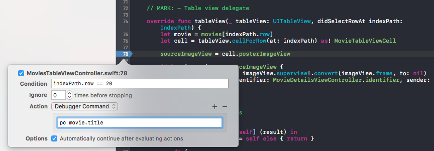
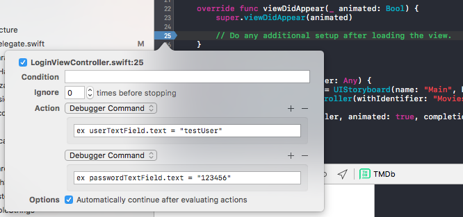
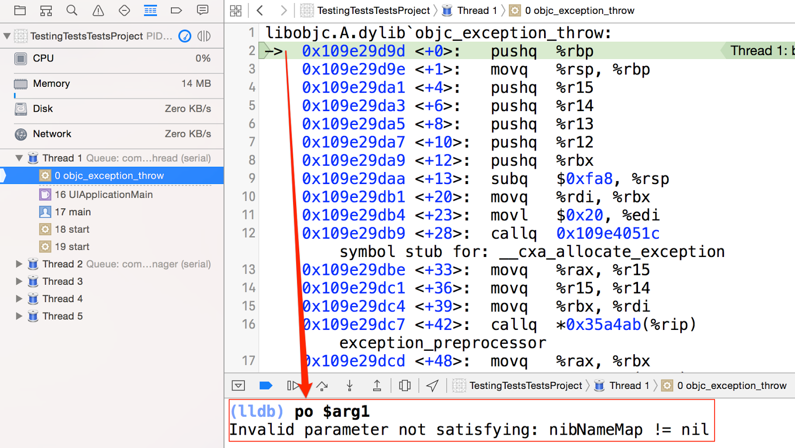
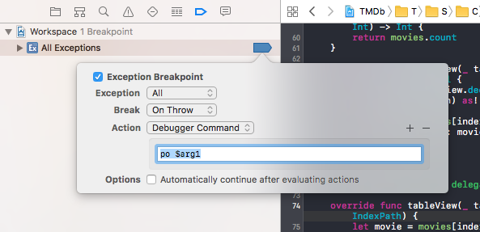
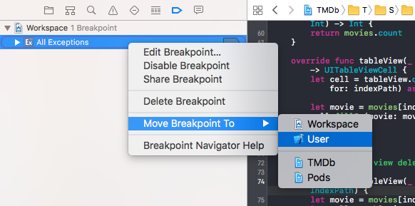
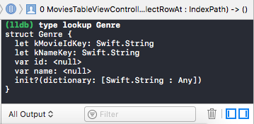
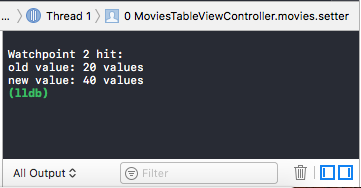
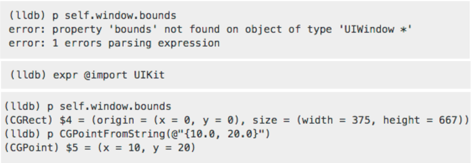

build-lists: true

# [fit] Debugging
## [fit] Tips and Techniques

---

## [fit]Salmo Junior

iOS developer since 2011, CocoaHeads Belo Horizonte chapter leader, traveller and cheese addict.


<br><br><br><br><br><br><br><br><br>

Senior iOS Developer at CI&T
junior.salmo@gmail.com
@salmojr

---

# Agenda

- Advanced Breakpoints
- LLDB Debugger Commands
- View Debugging

---

# [fit] Advanced Breakpoints

---

# Advanced Breakpoints

Xcode breakpoints offers us serveral great features in order to improve our debug experience, pushing us to another level as developers.

- Add conditions and actions
- Inject code instructions at runtime
- Automate repetitive steps among tests
- Configure breakpoints for your user
- Share breakpoints with your team
- Improve Exception Breakpoint usage

---

# Adding conditions and actions

Conditional breakpoints will only break when the condition is true, and any valid code that evaluates to a boolean can be used here. You can also use any variable available on the same scope where the break point is placed.
 


---

# Injecting code instructions at runtime

Stop adding hard-coded data during repetitive tests. It’s dangerous. With breakpoint actions and lldb expressions, there’s no need to rebuild the app.



---

# Improving Exception Breakpoint usage

All Exceptions breakpoint helps stopping right before a crash but sometimes it is not clear. Type **po $arg1** into the debug area to get the human-readable version of the error.



---

# Improving Exception Breakpoint usage

Making it even better. Edit your breakpoint and send it to your Xcode User and it will be available for all projects.

 

---

# Breakpoint Shortcuts 😁

Add/Remove breakpoint  =  command +  \\

Edit breakpoint  =  command + option + click

Breakpoints Navigator  =  command + 7

---

# Advanced Breakpoints
# [fit] Demo

---

# [fit] LLDB Debugger

---

# LLDB Debugger Commands

- Type Lookup
- Watchpoints
- Import Frameworks

---

# Type Lookup

The type lookup command allows you to get information about any type in the system.
Basically it's a header-like representation that you can get right there in the debugger to remind you about the contents of the type.



---

# Watchpoints

Watchpoint stops execution whenever the value of an expression changes, without having to predict a particular place where this may happen.

```
watchpoint set variable self.myProperty
watchpoint list
watchpoint delete <number>
```

<br>

Number of supported hardware watchpoints: 4



---

# Import Frameworks

When **lldb** is not able to print an object type properly, a simple *import* can fix it and improve the output message.



---

# LLDB Debugger
# [fit] Demo

---

# [fit] View Debugging

---

# View Debugging

- Xcode View Debugging
- iOS Simulator Debug
- UIDebuggingInformationOverlay

---

# Xcode View Debugging

Available since Xcode 6 this feature helps to analize view layers and easily identify and fix issues in an app's user interface.

<br>


---

# iOS Simulator Debug

Simulator has some great features on Debug menu option to help you find issues on app's user interface.


---

# UIDebuggingInformationOverlay

`UIDebuggingInformationOverlay` is a private `UIWindow` subclass created by Apple, presumably to help developers and designers debug Apple’s own iOS apps.

```Swift
let overlay = NSClassFromString("UIDebuggingInformationOverlay")
as? UIWindow.Type
_ = overlay?.perform(NSSelectorFromString("prepareDebuggingOverlay"))
```

<br><br><br><br><br><br><br><br>

 Don't send it to production


---

# View Debugging
# [fit] Demo

---

<br><br><br><br><br><br><br><br>

# [fit] Questions?

---

# References

[https://developer.apple.com/support/debugging](https://developer.apple.com/support/debugging)

[http://ryanipete.com/blog/ios/swift/objective-c/uidebugginginformationoverlay/](http://ryanipete.com/blog/ios/swift/objective-c/uidebugginginformationoverlay/)

---

# [fit] Thanks 

# for being here

<br><br><br><br><br><br><br><br><br>

junior.salmo@gmail.com
@salmojr