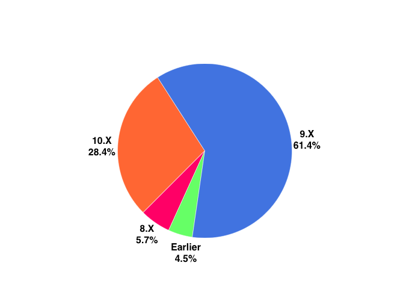

# Entendendo o processo de desenvolvimento de aplicativos iOS

---

## Salmo Junior

Mineiro, Chapter Leader do CocoaHeads BH, dev iOS desde 2011, corinthiano e viajante.

         

Sênior iOS Developer at CI&T
salmo@ciandt.com
@salmojr

---

## Agenda

- Overview
- Guidelines
- Consumo de Serviços
- Armazenamento
- Hardware e Limitações
- Dicas
- Ferramentas

---

## Overview

---

#### Overview

## Objective-C e Swift

 

---

#### Overview
## iOS Development Kit

- Xcode
- Interface Builder
- iOS Simulator
- Instruments

---

#### Overview
## Apple Developer Program

- Pagamento anual
- Acesso as versões beta
- Testes em vários devices
- Distribuição

---

#### Overview
## App Store

- 99 dólares anual
- Testes em número limitado de devices
- iTunes Connect
- Acesso a App Store mundial

---

#### Overview
## Enterprise

- 299 dólares anual
- Necessidade de D-U-N-S® number
- Sem acesso a App Store
- Somente distribuição interna

---

## Guidelines

---

#### Guidelines
## Utilização da Main Thread

 

---

#### Guidelines
## Interrupções

 

---

#### Guidelines
## Internacionalização

---

#### Guidelines
## Sincronismo de dados

- Sincronismo em background sempre que possível
- Conteúdo inicial offline

---

#### Guidelines
## Notificações

- Push Notification
- Silent Push Notification

---

#### Guidelines
## Semantic Versioning 2.0.0 

---

#### Guidelines
## Segurança

 

---

## Consumo de Serviços

---

#### Consumo de Serviços
## REST com JSON

- Melhor tempo de resposta
- Objetos mais simples
- Menor processamento

<!--poupando o consumo de dados-->
<!--devido a facilidade de conversão e interpretação-->

---

#### Consumo de Serviços
## Ambientes

---

#### Consumo de Serviços
## Versionamento e tempo de desenvolvimento

<!--Evita Retrabalho e Testes duplicados, com Mockup / Consumo real.
Evita Refactor tardio do time de Backend.
Desenvolvimento mobile simulando um ambiente real e já testado.
-->

---

## Armazenamento

---

#### Armazenamento
## Banco de dados

- Simples e compacto
- Suporte nativo
- Sem necessidade de configurações 
- Suporta criptografia

---

#### Armazenamento
## Arquivos

Arquivos como PDFs e imagens não devem ser armazenados direto no banco

---

#### Armazenamento
## Multiplos usuários

É possível criar vários bancos dentro de um mesmo aplicativo

---

## Hardware e Limitações

---

#### Hardware e Limitações
## Versões de S.O. são lançadas frequentemente

---

#### Hardware e Limitações
## Sensores

Uns dos grandes diferenciais dos smartphones

---

#### Hardware e Limitações
## Sensores

Mas também podem ser os grandes vilões

---

#### Hardware e Limitações
## Sensores 

Utilize de forma consciente

---

#### Hardware e Limitações
## Uso de banda de internet

- Minimize a quantidade de requisições
- Faça cache sempre que possível
- Verifique o tipo de conexão antes de downloads grandes

---

#### Hardware e Limitações
## Divisão de tarefas entre Aplicativo e Backend

<!--- Uma alteração do lado mobile implica no lançamento de uma nova versão
- Tempo de alteração/correção
- Poder de processamento-->

---

#### Hardware e Limitações
## Armazenamento

- Tamanho máximo de 2gb
- Até 20gb usando On-Demand Resouces

---

#### Hardware e Limitações
## Armazenamento

<!--Implementar rotinas para limpar os dados que não estão sendo mais utilizados pelo usuário, como Imagens e PDFs. 

Remover os assets que não são mais utilizados no projeto, sempre que lançar uma nova versão.
-->

---

## Dicas

---

#### Dicas
## Ganhe tempo com qualidade 

 

---

#### Dicas
## Acessibilidade

---

#### Dicas
## Qual versão de iOS Suportar?

---

#### Dicas
## Monetização

- Venda do aplicativo?
- In-App Purchase?
- Assinaturas?
- ~~Anúncios?~~

---

#### Dicas
## Extenda as funcionalidades de sua App

---

## Ferramentas

---

#### Ferramentas
## Integração Contínua

---

#### Ferramentas
## Integração Contínua

- **Jenkins** (http://jenkins-ci.org/)
- **CircleCI** (https://circleci.com/)
- **Bitrise** (https://www.bitrise.io/)
- **Travis CI** (https://travis-ci.org/)
- **Buddybuild** (https://buddybuild.com/)

---

#### Ferramentas
## Crash Reporting

---

#### Ferramentas
## Análise de performance

---

#### Ferramentas
## Gerenciamento de dependências

 

---

#### Ferramentas
## Analytics

---

#### Ferramentas
## Distribuíção/Beta Test

  

---

# [fit] Dúvidas?

---

# Obrigado!
## salmo@ciandt.com
### @salmojr
#### https://speakerdeck.com/salmojunior