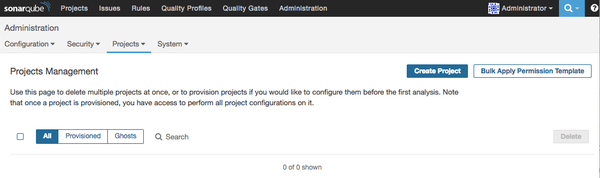

build-lists: true

# [fit]Entregando código **Swift**
# [fit]com qualidade

---

## Salmo Junior

- Chapter Leader do CocoaHeadsBH
- Dev iOS desde 2011
- Corinthiano
- Viajante


<br><br><br><br><br><br><br><br>

junior.salmo@gmail.com
@salmojr 

---

# Antes de começar... algumas perguntas! :)

---

# Perguntas

- O que fazem para garantir a qualidade de seus projetos iOS?
- Como fazem a coleta e companhamento de métricas?

---

# O que veremos hoje

Nessa talk vamos configurar um ambiente com o SonarQube para automatizar a análise de qualidade de projetos Swift.

 

---

# Motivações

---

# Motivações

* Código mais estável e organizado
* Devs. usando o tempo com o que gostam
* Métricas centralizadas
* Menor custo
* Satisfação do cliente/usuário

---

# Pré-requisitos

---

# Pré-requisitos

- Xcode 7 ou superior
- [Homebrew](https://brew.sh/)
- [PIP](https://pip.pypa.io/en/stable/installing/)
- [SonarQube](https://docs.sonarqube.org/display/SONAR/Setup+and+Upgrade)
- [Docker](https://www.docker.com/) - (Opcional)

---

# Ferramentas

---

# Ferramentas que vamos utilizar

- [SonarQube Scanner](https://docs.sonarqube.org/display/SCAN/Analyzing+with+SonarQube+Scanner)
- [Backelite Sonar-swift](https://github.com/Backelite/sonar-swift)
- [SwiftLint](https://github.com/realm/SwiftLint)
- [Tailor](https://github.com/sleekbyte/tailor)
- [slather](https://github.com/SlatherOrg/slather)
- [lizard](https://github.com/terryyin/lizard)
- [xcpretty](https://github.com/supermarin/xcpretty)

---

# Mãos à obra :)

---

# 1/12 - Instalar o SonarQube

Para esta demonstração vamos usar uma imagem do [Docker](https://hub.docker.com/_/sonarqube/), mas quem quiser fazer manualmente, pode ir direto para o site do [SonarQube](https://www.sonarqube.org/). Versão 6.3.1.

<br>

```
docker run -d --name sonarqube -p 9000:9000 -p 9092:9092 sonarqube
```

---

# 2/12 - Instalar o puglin sonar-swift

Baixar o plugin [Backelite Sonar-swift](https://github.com/Backelite/sonar-swift) e adicionar a nossa instancia do SonarQube.

- Baixar o plugin na pasta `'$SONARQUBE_HOME/extensions/plugins'`
- Reiniciar o SonarQube

---

# 3/12 - Criar um novo projeto no SonarQube



---

# 4/12 - Instalar o SwiftLint

O [SwiftLint](https://github.com/realm/SwiftLint) vai nos ajudar a fazer a análise estática e controle de code style. Instalar versão 0.3.0 ou acima.

<br>

```
brew install swiftlint
```

---

# 5/12 - Instalar o Tailor

O [Tailor](https://github.com/sleekbyte/tailor) é utilizado para análise estática e lint. Instalar versão 0.11.1 ou acima.

<br>

```
brew install tailor
```

---

# 6/12 - Instalar o Slather

O [Slather](https://github.com/SlatherOrg/slather) é responsável por gerar relatório de cobertura de testes. Instalar versão 2.1.0 ou acima.

<br>

```
gem install slather
```

---

# 7/12 - Instalar o Lizard

O [Lizard](https://github.com/terryyin/lizard) faz a análise de complexidade ciclomática de código para várias linguagens.

<br>

```
sudo pip install lizard
```

---

# 8/12 - Instalar o xcpretty

O [xcpretty](https://github.com/supermarin/xcpretty) é um wrapper sobre o `xcodebuild` que permite rodar comanddos de forma simples e rápida.

<br>

```
git clone https://github.com/Backelite/xcpretty.git
cd xcpretty
git checkout fix/duration_of_failed_tests_workaround
gem build xcpretty.gemspec
sudo gem install --both xcpretty-0.2.2.gem
```

---

# 9/12 - Configurar o projeto

Na raiz do projeto é preciso criar uma cópia do arquivo [sonar-project.properties](https://raw.githubusercontent.com/Backelite/sonar-swift/master/sonar-project.properties), fazendo as alterações de acordo com o seu projeto.

```
##########################
# Required configuration #
##########################

# Project key will also be used for binary file 
sonar.projectKey=prjKey
sonar.projectName=prjName
sonar.projectVersion=1.0
# Comment if you have a project with mixed ObjC / Swift
sonar.language=swift
.
.
```

---

# 10/12 - Instalar o SonarQube Scanner

Instale o SonarQube Scanner direto do [site](https://docs.sonarqube.org/display/SCAN/Analyzing+with+SonarQube+Scanner) oficial, ele será o responsável por análisar e enviar os dados para o SonarQube.
Para alterar o endereço do host, adicione as linhas abaixo no arquivo `sonar-project.properties`.

```
#----- Default SonarQube server
#sonar.host.url=http://localhost:9000
```

---

# 11/12 - Criar o script de Run

Faça uma cópia local do script [run-sonar-swift.sh](https://raw.githubusercontent.com/Backelite/sonar-swift/master/src/main/shell/run-sonar-swift.sh) para rodar juntamente, todas as ferramentas instaladas anteriormente.

<br>

```
./run-sonar-swift.sh
```

---

# 12/12 - Volte para o SonarQube

Se todos os passos foram seguidos corretamente, basta atualizar a página e você terá uma visão sobre a qualidade do seu projeto. :)

<br>


---

# Benefícios

---

# Benefícios

- Custo baixo (Todas as ferramentas são gratuitas e open-source)
- Code Review mais rápido e focado no que realmente interessa
- Sem necessidade de alterações e adição de dependências no projeto
- Fácil configuração e acompanhamento

---

# Dicas

---

# Dicas

- Configure preferencialmente no início do projeto
- Vincule como mais um *step* do seu *job* de CI, exemplo: [Jenkins](https://docs.sonarqube.org/display/SCAN/Analyzing+with+SonarQube+Scanner+for+Jenkins)
- Adicione à sua [lane](https://github.com/Backelite/sonar-swift/blob/develop/docs/sonarqube-fastlane.md), caso já utilize o Fastlane
- Issues críticas e bloqueantes não devem existir
- Converta ociosidade em refatoração de código
- O Dashboard deve ser acessível a todos do time

---

# [fit]Dúvidas?

---

# Obrigado!

### junior.salmo@gmail.com
### [Speaker Deck](https://speakerdeck.com/salmojunior)
### [@salmojr](https://twitter.com/SalmoJr)