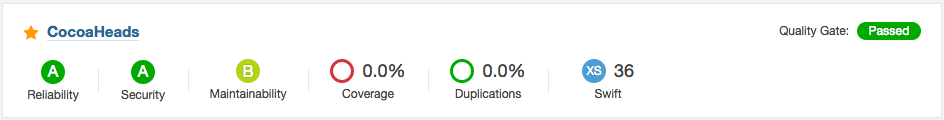

build-lists: true

# [fit]Entregando código 
# [fit]**Swift**
# [fit]com qualidade

---

## Salmo Junior

- Chapter Leader do CocoaHeadsBH
- Dev iOS desde 2011
- Corinthiano
- Viajante

        

junior.salmo@gmail.com
@salmojr 

---

# Entregando código Swift com qualidade

Nessa talk vamos configurar um ambiente com o SonarQube para análisar a qualidade de projetos Swift.

---

# Motivações

---

# Motivações

* Métricas centralizadas
* Código mais estável e organizado
* Devs. usando o tempo com o que gostam
* Satisfação do cliente/usuário
* Mais tempo e menor custo

---

# Ferramentas

---

# Ferramentas

- [SonarQube](https://docs.sonarqube.org/display/SONAR/Setup+and+Upgrade)
- [SonarQube Scanner](https://docs.sonarqube.org/display/SCAN/Analyzing+with+SonarQube+Scanner)
- [Backelite Sonar-swift](https://github.com/salmojunior/sonar-swift)
- [Docker](https://www.docker.com/) - (Opcional)

---

# Ferramentas

- [SwiftLint](https://github.com/realm/SwiftLint)
- [Tailor](https://github.com/sleekbyte/tailor)
- [slather](https://github.com/SlatherOrg/slather)
- [lizard](https://github.com/terryyin/lizard)
- [xcpretty](https://github.com/supermarin/xcpretty)

---

# Passo a Passo

---

---

---

---

---

---

---

---

---

---

---

---

# [fit]Demo

---

# Pontos a favor

---

# Pontos a favor

- Todas as ferramentas são gratuitas e open-source
- Sem necessidade de alterações no projeto
- Fácil configuração e acompanhamento

---

# Dicas

---

# Dicas

- Integre ao seu ambiente de CI, exemplo: [Jenkins](https://docs.sonarqube.org/display/SCAN/Analyzing+with+SonarQube+Scanner+for+Jenkins).
- Utilize com o [Fastlane](https://github.com/Backelite/sonar-swift/blob/develop/docs/sonarqube-fastlane.md)

---

# [fit]Dúvidas?

---

# Obrigado!

### junior.salmo@gmail.com

#### @salmojr